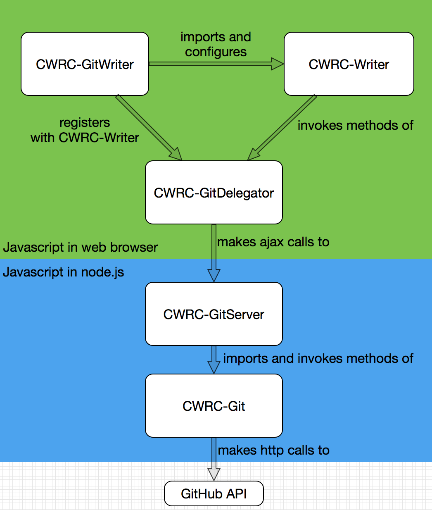

# CWRC-GitWriter

1. [Overview](#overview)
1. [Demo](#demo)
1. [Installation](#installation)
1. [Use](#use)
1. [Repository Organization](#repository-organization)
1. [Development](#development)
1. [Contributing](#contributing)
1. [License](#license)

### Overview

The CWRC-GitWriter is an instance of the [CWRC-Writer](https://github.com/cwrc/CWRC-Writer) configured to interact with an installed instance<sup id="a1">[1](#f1)</sup> of the [CWRC-GithubServer](https://github.com/cwrc/CWRC-GithubServer) which in turn uses Github for so called ‘back-end’ services:  document, annotation, and schema storage.

Any instance of the [CWRC-Writer](https://github.com/cwrc/CWRC-Writer) ( and in this case the instance is the CWRC-GitWriter) is configured to interact with a specific backend (in this case [CWRC-GithubServer](https://github.com/cwrc/CWRC-GithubServer)) by creating a javascript class that satisfies the CWRC [Delegator API](https://github.com/cwrc/CWRC-Writer#delegate-to-your-services). The delegator to interact with the [CWRC-GithubServer](https://github.com/cwrc/CWRC-GithubServer) is in it's own GitHub repository: [CWRC-GitDelegator](https://github.com/cwrc/CWRC-GithubServer) and published as an [NPM package](https://www.npmjs.com/package/cwrcgit).<sup id="a2">[2](#f2)</sup> and the CWRC-GitWriter simply imports it and registers it with the [CWRC-Writer](https://github.com/cwrc/CWRC-Writer).

The code in this repository essentially, therefore:

- imports the [CWRC-GitDelegator](https://github.com/cwrc/CWRC-GithubServer) NPM module that makes HTTP calls to an instance of the [CWRC-GithubServer](https://github.com/cwrc/CWRC-GithubServer)
- imports the [CWRC-Writer](https://github.com/cwrc/CWRC-Writer), and registers the [CWRC-GitDelegator](https://github.com/cwrc/CWRC-GithubServer) with it

When all put together, the flow runs a bit like this:



All the code and related libraries are packaged up together into a single javascript file, using [browserify](https://www.npmjs.com/package/browserify)

### Demo 

A [CWRC GitHub Sandbox](http://208.75.74.217/editor_github.html) uses the NPM package published from this repository along with the code in [CWRC-Writer](https://github.com/cwrc/CWRC-Writer), [CWRC-GitServer](https://github.com/cwrc/CWRC-GitServer), [CWRC-Git](https://github.com/cwrc/CWRC-Git), and [CWRC-GitDelegator](https://github.com/cwrc/CWRC-GitDelegator). The same code is easily (for someone with modest development experience) installed on any server to run your own instance.

### Installation

- Download the code for this repository, or clone the repository.
- install all the NPM package dependencies:
	```` npm install ````
- IMPORTANT:  YOU *MUST* AFTER THE INSTALL COMPLETES, edit:

```node_modules/jquery-ui/package.json```

and add the following:

```
"browserify": {
  "transform": [
	"deamdify"
  ]
}
```

- browserify the code to package it up for deployment:
	``npm build``
- deploy the app by copying the generated build directory to your web server.  You might choose to use ftp, scp, rsync, etc.  Or you might choose to fork this repository, adjust the configuration as needed, and deploy to a host that allows git deployment
- note that you will also have to install the [CWRC-GitServer](https://github.com/cwrc/CWRC-GitServer) on your server

### Use

This is an instance of the [CWRC-Writer](https://github.com/cwrc/CWRC-Writer) editor configured to use GitHub for backend storage. Instructions for using any instance of the CWRCWriter are at [CWRC-Writer](https://github.com/cwrc/CWRC-Writer).

### Repository Organization

This repository is organized as follows:

````
src/index.htm - imports the main.js file.

src/js/app.js - imports the CWRC-Writer npm module and initializes the editor.  Also registers the Github Delegator with the editor.

docs/images/ - folder of images for README

package.json - lists required npm packages, in particular the CWRC-WRiter and the CWRC-GitDelegator and defines build scripts including browserify, which bundles the entire application into a single javascript file in build/main.js

README - the README that are reading right now
````

### Development

The code in this repository simply brings together code from other repositories and wouldn't in itself typically be usefully modified.  You would only clone this repository to create a new deployment.

### Contributing

As explained in the development section you wouldn't typically usefully modify anything here for use by others.  Nevertheless, if there is something we've missed, please submit an Issue.

### License

[GNU GPL V2](LICENSE)


<b id="f1">1.</b> Instructions for installing the CWRC-GitServer are here: [CWRC-GitServer](https://github.com/cwrc/CWRC-GithubServer). [↩](#a1)

<b id="f2">2.</b> The [CWRC-GitDelegator](https://github.com/cwrc/CWRC-GithubServer) is in it's own github repository, and distributed as a discrete NPM module, to [keep separate things separate](https://en.wikipedia.org/wiki/Separation_of_concerns).  Packaging it separately allows us, for example, to package the tests for the delegator with the delegator itself (and makes writing the tests easier) as well making it perfectly clear that the delegator is a self contained chunck of code, and maybe more importantly enforces it's self-containedness (by preventing us from sneaking in a call to some internal part of the module, which we would probably end up doing if the delegator was part of this repository. [↩](#a2)